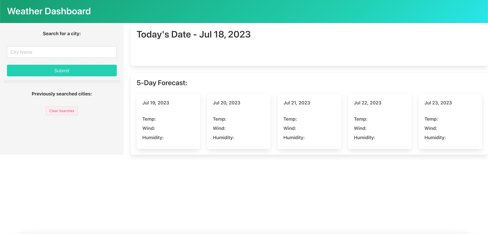

## Weather Dashboard

# Description
This applitcation allows the user to search the weather of all major cities uisng an api (openweathermap.org), generation up to date weather information that will
be shown in a 5 day forcast.

This has helped me develop the use of javascript and and using local storage to save the inputs from the user .

# Installation
N/A

# Usage
<link https://rickster1999.github.io/weather-dashboard/>Click Here</link>

To use this application the user will input the city they wish to search in to the search bar on the top left corner of the screen. The user will then see a 5-day forcast of there selected city ,and will also have the option of going back to a previously searched city by looking and selecting the city that was saved on the left side of the screen under the search bar.
If the user wishes to clear there search history they can do so by selecting the "Clear Searches" button under the search history.

